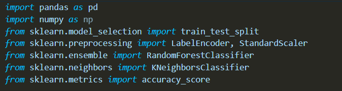
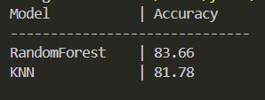

# Makine-Ogrenmesi-final-Odev

  

## Giriş

Bu projede akıllı evlerden elde edilen enerji tüketim verileri kullanılarak, evin enerji tüketiminin normal seviyelerin üzerinde olup olmadığı incelenmiştir. Analizde saat bilgisi ve hava koşulları gibi temel çevresel faktörler dikkate alınmıştır.

Veri seti üzerinden pivot tablolar oluşturularak, farklı saatler ve sıcaklık değerleri için ortalama enerji tüketimleri hesaplanmıştır. Elde edilen bu ortalama değerler, evin normal tüketim davranışını temsil eden referans bilgiler olarak modele eklenmiştir.

Son olarak bu veriler kullanılarak makine öğrenmesi modelleri ile enerji tüketiminin ortalamanın üzerinde olup olmadığı tahmin edilmiştir.

## Kodların açıklamaları

### Kütüphanelerin Eklenmesi

Bu bölümde veri işleme ve modelleme aşamalarında kullanacağım kütüphaneleri projeye dahil ettim.
Pandas veri setini okumak ve düzenlemek için, scikit-learn kütüphanesini ise veri ayırma, ölçekleme ve makine öğrenmesi modellerini kurmak için kullandım. Ayrıca model başarısını ölçmek için accuracy_score fonksiyonunu ekledim.

### Veri Setinin Okunması ve Ön İşleme

Bu bölümde veri setini programa okudum ve zaman bilgisini düzenledim. time sütununu sayısal hale getirip hatalı olan satırları temizledim, ardından zaman bilgisini kullanarak saat (hour) bilgisini çıkardım.

Daha sonra enerji tüketimi ve hava koşullarını temsil eden gerekli sütunları sayısal formata dönüştürdüm ve eksik verileri temizledim. Son olarak, metin şeklinde olan hava durumu bilgisini (summary) makine öğrenmesi modellerinde kullanılabilmesi için LabelEncoder ile sayısal hale getirdim.

### Pivot Tablolar ve Hedef Değişken

Bu bölümde enerji tüketiminin farklı koşullardaki normal davranışını görebilmek için pivot tablolar oluşturdum.
İlk pivot tabloda saat bazlı, ikinci pivot tabloda ise sıcaklık bazlı ortalama enerji tüketimlerini hesapladım. Elde edilen bu ortalama değerleri veri setine ekleyerek her kayıt için referans (normal) tüketim bilgisi oluşturdum.

Ayrıca hedef değişkeni belirlerken, enerji tüketimi değeri ortalamanın üzerindeyse 1, altında ise 0 olacak şekilde sınıflandırma yaptım.

### Özellik Seçimi ve Veri Ayırma

Bu bölümde modelde kullanılacak giriş değişkenlerini belirledim. Saat bilgisi, hava koşulları ve pivot tablolarla elde edilen normal tüketim değerlerini birlikte kullandım.

Daha sonra veri setini eğitim ve test olacak şekilde ayırarak modeli eğitime hazır hale getirdim.

### Modellerin Eğitilmesi ve Sonuçların Değerlendirilmesi

Bu kısımda önce Random Forest modelini eğittim ve test verisi üzerindeki doğruluk oranını hesapladım. Ardından KNN modeli için verileri ölçeklendirdim çünkü KNN mesafe tabanlı çalıştığı için ölçeklendirme gerekiyor. KNN modelini de eğitip doğruluk değerini elde ettim.

### Çıktı

Bu çıktıda Random Forest ve KNN modellerinin doğruluk oranlarını sade bir tablo halinde karşılaştırdım. Sonuçlara göre Random Forest modeli bu veri setinde KNN modeline kıyasla biraz daha başarılı çıktı.

## Sonuç
Yapılan analizler sonucunda, saat ve hava koşullarına göre oluşturulan pivot tabloların enerji tüketimini yorumlamada faydalı olduğu görülmüştür. Bu pivotlardan elde edilen ortalama tüketim değerleri, modelin daha anlamlı tahminler yapmasına yardımcı olmuştur.

Kullanılan modeller arasında Random Forest algoritması daha dengeli sonuçlar verirken, KNN modeli de benzer bir performans göstermiştir. Genel olarak, pivot tablolarla desteklenen bu yaklaşımın enerji tüketimi sınıflandırması için uygun ve uygulanabilir olduğu sonucuna varılmıştır.

## Katılım Sertifikları 
Makine Öğrenmesi dersi için 2 tane btk akademi kursu bitirdim sertifikalarım aşşağıdadır.
### Makine öğrenmesi

### Python

