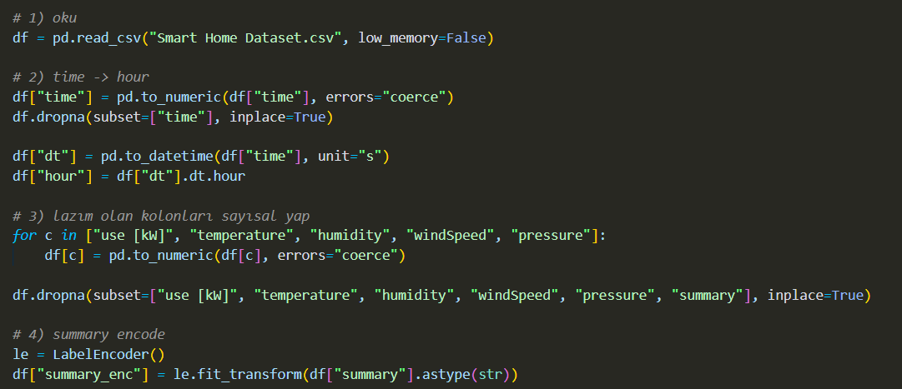
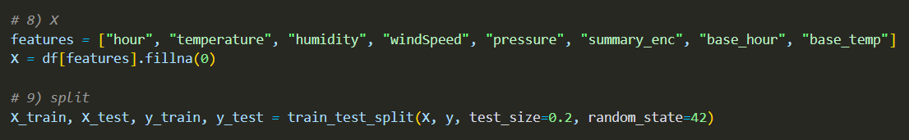
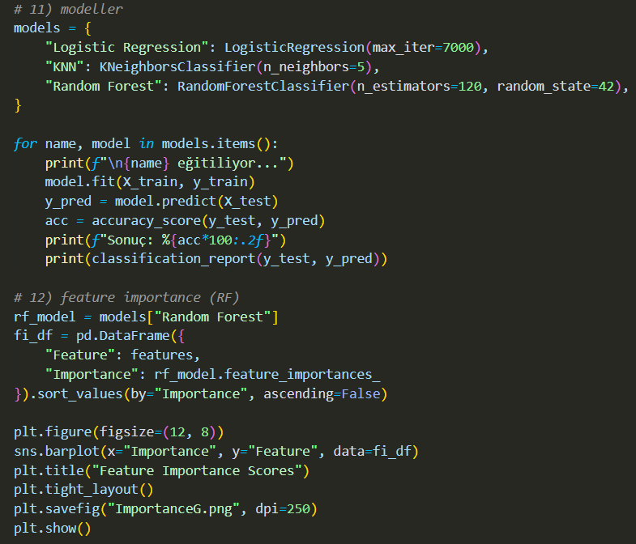
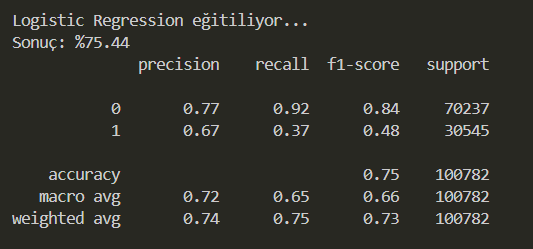
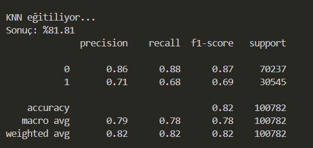
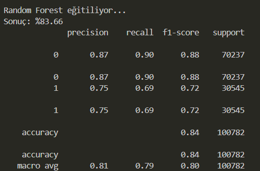
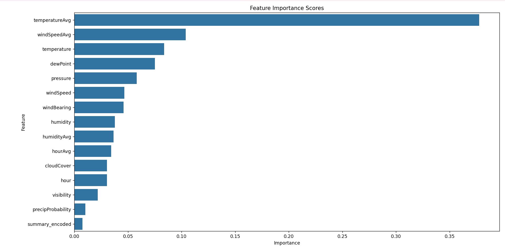

# Makine-Ogrenmesi-final--dev

  

## 🏠Giriş

Bu projede, akıllı evlerden elde edilen enerji tüketim verileri kullanılarak evin enerji tüketiminin normal seviyelerin üzerinde olup olmadığı incelenmiştir. Çalışmada saat ve hava koşulları gibi çevresel faktörlerin enerji tüketimi üzerindeki etkisi ele alınmıştır.

Veri seti; toplam enerji tüketimi ile birlikte sıcaklık, nem, rüzgar hızı ve hava durumu bilgilerini içermektedir. Bu veriler kullanılarak farklı koşullardaki ortalama enerji tüketimleri pivot tablolar yardımıyla hesaplanmış ve bu değerler evin normal tüketim davranışını temsil eden referanslar olarak modele dahil edilmiştir.

Son aşamada ise bu bilgiler kullanılarak farklı makine öğrenmesi algoritmaları ile enerji tüketiminin ortalamanın üzerinde olup olmadığı tahmin edilmiştir.

## 💻Kodların açıklamaları

### Kütüphanelerin Eklenmesi

Bu bölümde proje boyunca kullanacağım kütüphaneleri ekledim. Verileri işlemek için Pandas ve Numpy kullandım. Modelleme aşamasında eğitim–test ayırma, farklı makine öğrenmesi algoritmaları ve değerlendirme işlemleri için Scikit-learn kütüphanesinden faydalandım. Kategorik verileri sayısal hale getirmek için LabelEncoder, verileri ölçeklemek için ise StandardScaler kullandım. Sonuçları görselleştirmek amacıyla matplotlib ve seaborn kütüphanelerini ekledim.

### Veri Setinin Okunması ve Ön İşleme

Bu bölümde veri setini programa okudum. Büyük bir veri olduğu için okuma sırasında low_memory=False kullandım. time sütununda sayısal olmayan değerler bulunduğundan bu alanı sayısala çevirdim ve hatalı satırları temizledim. Daha sonra zaman bilgisini datetime formatına dönüştürerek her kayıt için hour bilgisini oluşturdum.

Ayrıca sıcaklık, nem ve rüzgar hızı gibi hava koşullarını temsil eden sütunları sayısal hale getirdim ve eksik verileri temizleyerek modelin daha sağlıklı verilerle eğitilmesini sağladım.

### Kategorik Verinin Sayısallaştırılması ve Pivot Baseline Oluşturulması

Bu aşamada makine öğrenmesi modellerinde kullanabilmek için sayısal olmayan summary sütununu LabelEncoder ile sayısal hale getirdim. Daha sonra enerji tüketiminin farklı koşullardaki normal davranışını görebilmek için saat, sıcaklık, nem ve rüzgar hızı değerlerine göre pivot tablolar oluşturdum. Bu pivotlar sayesinde belirli koşullarda evin ortalama ne kadar enerji harcadığını elde ettim.

Elde edilen ortalama tüketim değerlerini veri setine ekleyerek her kayıt için ilgili koşullara ait referans (baseline) tüketim bilgisini modele dahil ettim.

### Hedef Değişkenin Belirlenmesi ve Veri Setinin Hazırlanması

Bu aşamada enerji tüketimini sınıflandırmak için hedef değişken oluşturdum. Tüketim değeri veri setindeki ortalama ile karşılaştırılarak, ortalamanın üzerindeki değerler 1, altındaki değerler 0 olarak etiketlendi ve problem ikili sınıflandırma haline getirildi.

Modelde saat bilgisi, hava durumu verileri ve pivot tablolarla elde edilen ortalama tüketim (baseline) değerlerini birlikte kullandım. Birleştirme işlemlerinden sonra oluşan eksik değerleri doldurdum ve değişkenleri StandardScaler ile ölçeklendirdim. Son olarak veri setini eğitim ve test olarak ayırarak modelleme aşamasına hazır hale getirdim.

###Modellerin Eğitilmesi ve Sonuçların Değerlendirilmesi

Bu bölümde farklı makine öğrenmesi algoritmalarını kullanarak modelleme yaptım. Karşılaştırma yapabilmek için Lojistik Regresyon, KNN ve Random Forest modellerini denedim. Her bir modeli eğitim verisiyle eğittim ve test verisi üzerinde tahmin yaparak doğruluk sonuçlarını hesapladım.

Modellerin performansını daha iyi görebilmek için doğruluk değerlerinin yanında classification_report çıktısını da inceledim. Son olarak Random Forest modelinin özellik önemlerini kullanarak enerji tüketimini en çok etkileyen değişkenleri analiz ettim ve bu sonuçları grafik ile gösterdim.

## 📊Çıktılar
### Logistic Regression

Bu çıktıda Lojistik Regresyon modeli eğitilmiş ve test verisi üzerinde yaklaşık %75 doğruluk elde edilmiştir. Model, özellikle düşük tüketim sınıfını (0) ayırt etmede daha başarılıdır. Yüksek tüketim sınıfında (1) ise başarı oranı daha düşüktür, bu da modelin genel eğilimi yakalasa da detaylı ayrımda sınırlı kaldığını göstermektedir.
### KNN

Bu çıktıda KNN modeli eğitilmiş ve yaklaşık %81.81 doğruluk elde edilmiştir. Lojistik Regresyon’a göre daha yüksek bir başarı sağladığı görülmektedir. Özellikle yüksek tüketim sınıfında (1) daha dengeli sonuçlar verdiği ve sınıflar arasındaki ayrımı daha iyi yaptığı söylenebilir.
### Random Forest

Bu çıktıda Random Forest modeli eğitilmiş ve yaklaşık %84 doğruluk elde edilmiştir. Diğer modellerle karşılaştırıldığında en yüksek başarıyı sağlayan modelin Random Forest olduğu görülmektedir. Hem düşük hem de yüksek tüketim sınıflarında daha dengeli sonuçlar verdiği için genel performans açısından en başarılı model olarak değerlendirilebilir.

Bu grafikte Random Forest modelinin hangi değişkenleri daha çok dikkate aldığı gösterilmektedir. Sıcaklık ve rüzgar hızı gibi çevresel faktörlerin enerji tüketimi üzerinde daha etkili olduğu görülmektedir.

Bu grafikte Random Forest modelinin özellik önemleri verilmiştir. Sıcaklık ve rüzgar hızı gibi çevresel faktörlerin enerji tüketimi üzerinde daha etkili olduğu görülmektedir.
## ✅Sonuç
Bu çalışmada akıllı ev enerji tüketim verileri kullanılarak, evin enerji tüketiminin ortalamanın üzerinde olup olmadığı incelenmiştir. Analiz sürecinde saat ve hava koşullarına göre oluşturulan pivot tablolar yardımıyla elde edilen ortalama tüketim değerleri modele dahil edilmiştir.

Pivot tablolar sayesinde farklı koşullardaki normal enerji tüketim davranışı daha net görülmüş, bu referans değerlerin modele eklenmesi tüketimin daha sağlıklı değerlendirilmesini sağlamıştır. Uygulanan modeller arasında Random Forest algoritmasının daha başarılı sonuçlar verdiği gözlemlenmiş, özellikle saat bilgisi ve pivotlardan elde edilen ortalama tüketim değerlerinin önemli olduğu anlaşılmıştır.

Sonuç olarak, pivot tabloların kullanıldığı bu yaklaşımın enerji tüketimi analizi ve sınıflandırma problemleri için uygun ve uygulanabilir olduğu görülmüştür.

## 🎓Katılım Sertifikları 

### Makine öğrenmesi

### Python

